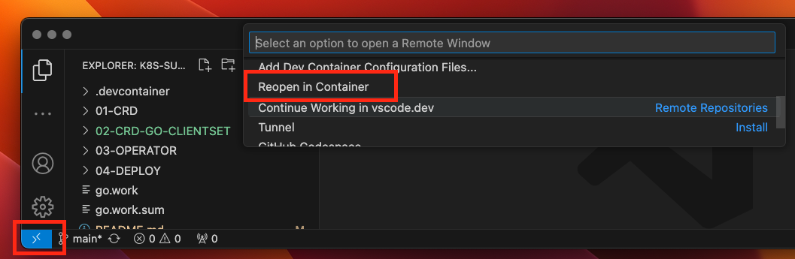

# K8S-Summit-2024-Operator101


|        |                                               |
|--------|-----------------------------------------------|
| Step-1 | [設計CRD](./01-CRD/README.md)                 |
| Step-2 | [生成CR API](./02-CRD-GO-CLIENTSET/README.md) |
| Step-3 | [撰寫 Operator](./03-OPERATOR/README.md)      |
| Step-4 | [部署](./04-DEPLOY/README.md)                 |


## 用 KinD 準備測試用K8S

```bash
kind create cluster --config 00-PREPARE/kind.yaml
```

## 準備 devcontainer Image
二擇一準備 image。

```bash
# download image
wget https://cos.twcc.ai/jimmycos/k8s-summit-2024/k8s-summit.tar
docker load < k8s-summit.tar

# 或 build image
cd K8S-Summit-2024-Operator101
docker build -t k8s-summit:latest  -f .devcontainer/Dockerfile .
```

## 用VSCode建立開發環境

VSCode 開啟 K8S-Summit-2024-Operator101 devcontainer


